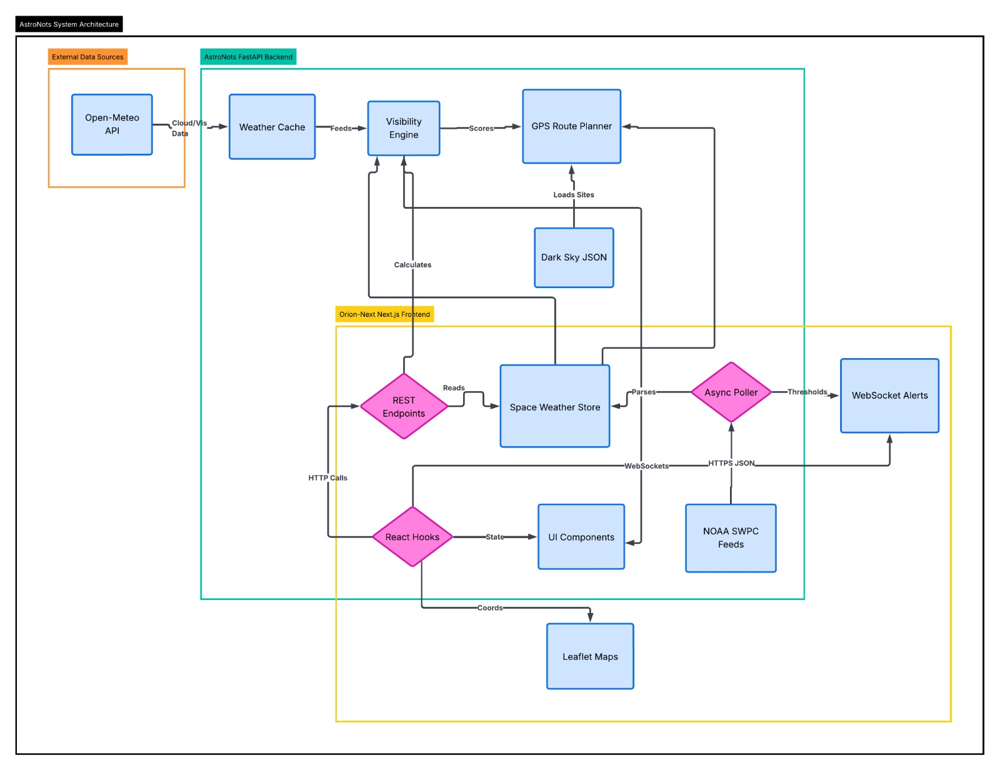

# Aurora Intelligence Platform (AstroNots)

> Hyper-local aurora forecasting, real-time alerts, and astrophotographer intelligence platform — Orion Astrathon 2026.



---

## Overview

The **Aurora Intelligence Platform** is a full-stack, real-time application designed to predict and hunt the aurora borealis/australis with unparalleled precision. It merges raw telemetry from NOAA's DSCOVR satellite, dark-sky modeling, and dynamic 3D visualizations to provide astrophotographers with everything they need to capture the perfect shot.

---

## Tech Stack

**Frontend (`orion-next`)**
- **Framework:** Next.js (React 19)
- **3D Graphics:** Three.js & `@react-three/fiber`
- **Mapping:** Leaflet (`react-leaflet`) with custom Canvas blending
- **Styling:** Tailwind CSS & Framer Motion
- **Charting:** Recharts

**Backend (`backend`)**
- **Framework:** FastAPI (Python 3.10+)
- **Async Processing:** `asyncio` & `httpx`
- **Job Scheduling:** APScheduler
- **Astronomical Math:** `ephem` for lunar & twilight calculations
- **Weather API:** Open-Meteo & Meteoblue (for cloud cover)

---

## Backend Architecture & Technical Details

The backend acts as a highly resilient data aggregation and processing engine.

### 1. Robust NOAA Polling & Failover (`services/noaa_poller.py`)
- **Async Fetching:** Uses an exponential-backoff retry mechanism to guarantee resilience when fetching from NOAA SWPC endpoints (Magnetometer, Plasma, Kp, OVATION, and Alerts).
- **DSCOVR → ACE Failover:** Magnetometer data primarily comes from DSCOVR. If a data gap (>15m) or HTTP error occurs, the system automatically falls back to the ACE satellite feed, emitting a structured log event.
- **Schema Auto-Detection:** The parser dynamically detects and handles both legacy NOAA formats (array-of-arrays) and the new 2026+ JSON schema.
- **In-Memory Store:** The `SpaceWeatherStore` singleton holds the most recent state in memory for lightning-fast API responses (pre-calculated state instead of computed-on-request).

### 2. Composite Visibility Engine (`services/visibility.py`)
Calculates a **0-100 Visibility Score** using a weighted multi-factor algorithm:
- **Aurora Probability (45%):** Spatially interpolates NOAA OVATION model data. If the user is between data points, it inversely weights by distance.
- **Darkness Score (30%):** A three-part combination:
  - **Bortle Class:** Estimated using Haversine distance to major light-polluted cities. 
  - **Lunar Illumination:** Calculated using `ephem`, factoring in moon phase and altitude above the horizon.
  - **Astronomical Twilight:** `ephem` calculates solar depression. (Sun altitude < -18° grants max score).
- **Cloud Cover (25%):** Fetches hourly multi-level cloud coverage from Open-Meteo/Meteoblue. Low-altitude clouds are penalized heavily (70%), while high clouds are penalized less (10%), mimicking real-world aurora hunting where wispy cirrus clouds are acceptable.

### 3. Early Warning & WebSocket Alerts (`services/alerts.py`)
- Real-time event streaming built on FastAPI WebSockets.
- **Substorm Precursor Detection:** Computes the $B_z$ rate of change ($nT/min$). If the rate drops below `-0.5 nT/min`, it broadcasts a warning that a substorm onset is likely within ~10 minutes.
- **Shockwave Impact Delay Math:** When solar wind speeds spike, the backend calculates the exact L1-to-Earth transit delay (Distance = 1.5M km) and broadcasts an ETA for the geomagnetic shockwave.

### 4. Dynamic GPS Routing (`services/routing.py`)
A stretch-goal routing engine that finds the nearest "perfect" aurora viewing spot.
- Checks user coordinates against a curated JSON database of **Certified International Dark Sky Parks**.
- If no park is nearby, it casts rays in an expanding radial grid (8 bearings, up to 250km poleward).
- Evaluates constraints simultaneously: *Aurora Prob > 50%, Cloud Cover < 30%, Bortle Class < 4*.
- Returns actionable driving waypoints and a direct Google Maps URL.

---

## Frontend Architecture & Technical Details

The frontend is an immersive, glassmorphism-heavy tactical dashboard designed for high-stress, low-light field environments.

### 1. Immersive 3D Earth (`components/Earth3D.tsx`)
Built with Three.js and `@react-three/fiber` to serve as an interactive, data-driven background:
- **Solar Wind Particles:** 1000 animated particles stream towards the camera to simulate the solar wind, utilizing `AdditiveBlending` for an intense, glowing look without high GPU overhead.
- **Magnetosphere & Aurora:** A rotating wireframe globe wrapped in intersecting torus geometries (simulating magnetic field lines) and a glowing, pulsating aurora ring at the poles.

### 2. Glowing OVATION Map (`components/AuroraMap.jsx`)
A totally custom `react-leaflet` implementation.
- Standard GeoJSON was too heavy and ugly. Instead, we built a raw HTML `<canvas>` overlay (`OvationLayer`).
- Iterates through hundreds of OVATION grid points, mapping them to coordinates.
- Uses **Screen/Lighter Blend Modes** (`globalCompositeOperation = "lighter"`) and radial gradients. Overlapping low-probability zones organically combine to create an intense, realistic auroral glow (mapping probabilities to Crimson, Violet, Emerald, and Dark Green).
- Uses a sleek Cartesian dark-mode tile layer (`dark_nolabels`) to make the colors pop.

### 3. Real-Time HUD (`app/page.jsx`)
- Built with Framer Motion for buttery-smooth mount animations.
- Subscribes via `useWebSocket` to live backend telemetry. If a $B_z$ threshold is breached, the UI flashes and updates instantly.
- Glassmorphism panels (using Tailwind `backdrop-blur-xl`) provide contrast against the 3D background.

---

## Quick Start (Local Deployment)

### 1. Clone & Enter
```bash
git clone https://github.com/YOUR_TEAM/aurora-platform.git
cd aurora-platform
```

### 2. Start the Backend
```bash
cd backend
python -m venv .venv
# Windows: .venv\Scripts\activate
# Mac/Linux: source .venv/bin/activate
pip install -r requirements.txt
cp .env.example .env
uvicorn app.main:app --reload --port 8000
```
> API live at: `http://localhost:8000`  
> Swagger Docs: `http://localhost:8000/docs`

### 3. Start the Frontend
In a new terminal:
```bash
cd orion-next
npm install
npm run dev
```
> UI live at: `http://localhost:3000`

---

## API Reference

| Method | Path | Description |
|---|---|---|
| `GET` | `/health`, `/api/health` | Comprehensive liveness & telemetry check |
| `GET` | `/api/space-weather/status` | Current $B_z$, Speed, Kp, Alert Flags, Client counts |
| `GET` | `/api/space-weather/mag` | Last 120 IMF / $B_z$ readings (DSCOVR/ACE) |
| `GET` | `/api/space-weather/plasma` | Last 120 Solar wind speed & density readings |
| `GET` | `/api/space-weather/ovation` | 360×181 probability grid points |
| `GET` | `/api/space-weather/kp` | Current and recent Planetary K-index |
| `GET` | `/api/visibility?lat=&lon=` | Complete 0-100 Composite Visibility Score payload |
| `GET` | `/api/routing?lat=&lon=` | Generates route to nearest clear/dark/active site |
| `WS` | `/ws/{client_id}` | Live WebSocket stream for substorm/speed alerts |

---
*Built tightly and cleanly by AstroNots.*
